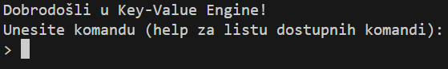
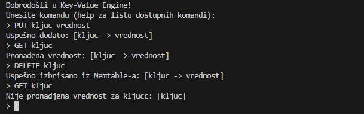
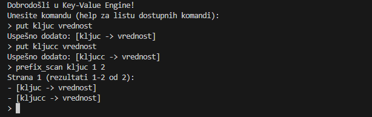

# 🗄️ NASP Key-Value Engine

Grupni projekat iz predmeta **„Napredni algoritmi i strukture podataka“** na FTN SIIT.

Ovaj projekat predstavlja **key-value bazu podataka** implementiranu u programskom jeziku **Go**, sa podrškom za:

- Memtable (B-Tree, SkipList, HashMap)
- SSTable i kompresiju
- Segmentirani Write-Ahead Log (WAL)
- Probabilističke strukture podataka (Bloom Filter, Count-Min Sketch, HyperLogLog, SimHash)
- LRU cache
- Merkle Tree
- Cursor-i i multi-cursor-i
- Config fajlovi (.json)
- CLI interfejs

---

## 🧠Struktura projekta

```
root/
├── config/           # Konfiguracija sistema
├── structs/          # Glavne strukture podataka
│   ├── blockmanager/       # Blok menadžment i keširanje
│   ├── containers/         # Memtable strukture: B-Tree, HashMap, SkipList
│   ├── cursor/             # Cursor-i za čitanje
│   ├── lrucache/           # Least Recently Used cache
│   ├── memtable/           # Menadžment memtable
│   ├── merkletree/         # Merkle stablo za verifikaciju
│   ├── probabilistic/      # Probabilističke strukture
│   ├── sstable/            # SSTable sa kompresijom
│   └── wal/                # Write-Ahead Log
├── utils/            # Pomoćne funkcije
└── main.go           # Ulazna tačka
```

---

## 🚀 Pokretanje projekta

Za pokretanje sistema:

```go
go run main.go
```

Konfiguracija se nalazi u `config/config.json`.

---

## 📸 Prikaz rada

U nastavku su predviđena mjesta za slike (screenshote) koje prikazuju funkcionalnosti sistema. Slike dodati u `docs/` folder i referencirati relativno.

### 🟢 Pokretanje sistema



---

### 📝 Upis, čitanje i brisanje podataka



---

### 🔍 Prefix scan komanda



---

## ⚙️ Konfiguracija

Parametri se definišu u `config/config.json`. 
Primer:
```json
{
"MaxMemtableSize": 10,
"MemtableNum": 4,
"MemtableStruct": "hashMap",
"SkipListLevelNum": 5,
"BTreeDegree":2,

"BlockSize": 128,
"BlockCacheSize": 20,
"LRUCacheSize":3,

"TokenRate": 100,
"TokenInterval": 60,
"WalMaxRecordsPerSegment": 50,
"WalBlocksPerSegment": 3,

"SummaryStep": 4,
"SSTableSingleFile": true,
"SSTableCompression": false,
  
"CompactionAlgorithm":"SizeTiered",
"MaxCountInLevel":5
}
```

---


## 👥 Autori

- Nikša Čvorović (@niksacvorovic)
- Jovan Cvijanović (@AStroCvijo)
- Lenka Nikolić (@lenkaphantom)
- Teodora Aleksić (@aleksteodora)
